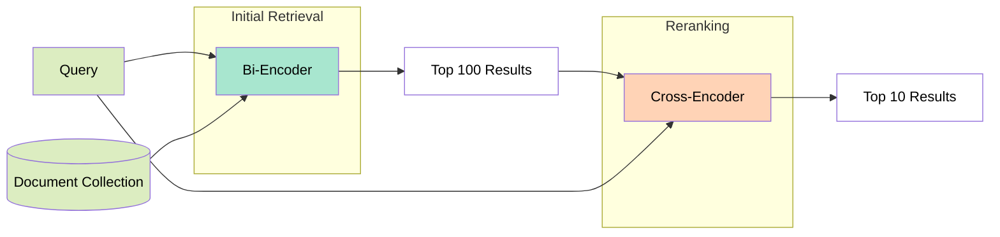
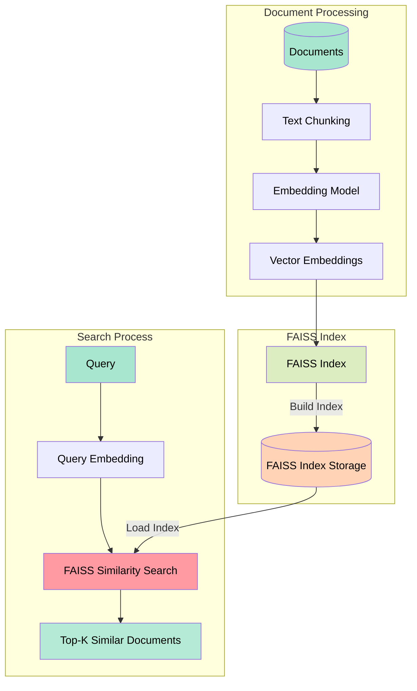

# DenseRetrievalProject

Under [format_convertor directory](https://github.com/Minerva142/DenseRetrievalProject/tree/main/format_converter) , there are some python scripts to format data, formatted data is used by the **data_preparing_X.py** scripts which are under the [data_prepare_files](https://github.com/Minerva142/DenseRetrievalProject/tree/main/data_prepare_files) directory. These files provide the training and whole data for training parts. Befor using, you need to create all dataset and directories which are needed. Furthermore, you need to install all needed libraries.  

## Approaches
Rather then the second approach, all approaches are using BERT model and BERT encoders(for *.py files). Approximately 66 percent of the dataset was used for training, the rest was used for testing purposes to calculate metric values in faiss index implementations.

approaches number tagged with the number of approach(as suffix) to implementation files.

* [aprroach_1](https://github.com/Minerva142/DenseRetrievalProject/blob/main/model_implementations/projectBert_1.py) is training dense retriever with exact one positive and one negative document for each query. Here are the test setup: 
    | Parameter        | Value               |
    |------------------|---------------------|
    | model_name       | "bert-base-uncased" |
    | max_length       | 128                 |
    | batch_size       | 2                   |
    | learning_rate    | 2e-5                |
    | epochs           | 3                   |
    | optimizer        | AdamW               |

* [aprroach_2](https://github.com/Minerva142/DenseRetrievalProject/blob/main/model_implementations/projectBertWithReRank_2.py) is dense retrieval with reranking model .Training them with multiple positive and negative documents for each query. It uses already pre-trained(for starting point) cross encoder model as reranker and also use dual encoder for retrieving part. BCEWithLogitsLoss is used while training for cross_encoder and cross entropy loss used for dual_encoder. this approach is actually an approach that uses both a bi-encoder and a cross encoder, the bi-encoder lists the top 100 documents, then the cross encoder re-ranks these 100 documents and reduces them to 10. Here are the setup values:
  | Parameter                | Value                                      |
  |--------------------------|--------------------------------------------|
  | dual_encoder             | microsoft/mpnet-base                      |
  | cross_encoder            | cross-encoder/ms-marco-MiniLM-L-6-v2    |
  | tokenizer                | microsoft/mpnet-base                      |
  | batch_size               | 8                                          |
  | num_epochs               | 3                                         |
  | learning_rate            | 2e-5                                      |
  | dual encoder loss        | cross entropy loss                         |
  | cross encoder loss       | BCEWithLogitsLoss                         |
  | optimizer                | AdamW                                    |

  

* [aprroach_3](https://github.com/Minerva142/DenseRetrievalProject/blob/main/model_implementations/ProjectBertDenseRetrieverMultiWotReRank_3.py) is training dense retriever with one positive and multiple negative documents for each query.
  
* [aprroach_4](https://github.com/Minerva142/DenseRetrievalProject/blob/main/model_implementations/projectBetMultiPosAndNeg_4.py) is training dense retriever with one positive and multiple negative documents for each query. Actually, it is limited with 5 for short training. 
    | Parameter         | Value                  |
    |-------------------|------------------------|
    | epochs            | 3                      |
    | learning_rate     | 2e-5                   |
    | loss function      | TripletMarginLoss      |
    | optimizer         | AdamW                  |

* Furthermore there are 4 different faiss index without training. [First](https://github.com/Minerva142/DenseRetrievalProject/blob/main/faiss_implementations/DirectBert_with_faiss_wot_training.py) one is BERT model and BERT tokenizer faiss, and the [second](https://github.com/Minerva142/DenseRetrievalProject/blob/main/faiss_implementations/faiss_just_using_bert_tokenizer.py) one is directly using BERT tokenizer. [Third](https://github.com/Minerva142/DenseRetrievalProject/blob/main/faiss_implementations/faiss_index_implementation_SBERT.py) it directly uses the pre-trained BERT sentence transformer as encoder. (Implemented but not trained and tested)

* We also tested many different pre-trained models on the dataset. Tests were also performed with BM25 to provide a value comparison. Implementations are in kaggle notebooks, and also provided under [here](). Below you can see the list of these tested models: 
  

| Model Name                                 |
|--------------------------------------------|
| BM25                                       |
| all-mpnet-base-v2                          |
| multi-qa-mpnet-base-cos-v1                 |
| multi-qa-mpnet-base-dot-v1                 |
| all-MiniLM-L6-v2                           |
| multi-qa-MiniLM-L6-cos-v1                  |
| all-MiniLM-L12-v2                          |
| multi-qa-distilbert-cos-v1                 |
| all-distilroberta-v1                       |
| multi-qa-MiniLM-L6-dot-v1                  |
| multi-qa-distilbert-dot-v1                 |
| distiluse-base-multilingual-cased-v2       |
| distiluse-base-multilingual-cased-v1       |
| llama3_2_1b_instruct                       |

  
  

## Kaggle Implementations
example with llama:

https://www.kaggle.com/code/eraygnlal/llama-dense-retrieval-inference/edit  
https://www.kaggle.com/code/eraygnlal/llama-dense-retrieval-inference-trec-eval-added

In these approaches, a pre-trained llama model was used as an encoder. A faiss index was then created and metric calculations were performed with the pytrec_eval library. The data used here was created with data formatter scripts available on the repository.

Other models have been tested with this approach also.

## Faiss Index Implementations

Faiss implementations can be found under this [directory](https://github.com/Minerva142/DenseRetrievalProject/tree/main/faiss_implementations). Each of them feeded with dataset which are provided with this [script](https://github.com/Minerva142/DenseRetrievalProject/blob/main/data_prepare_files/data_preperar_for_faiss_and_validation.py). Document number is limited with 50000 for testing purposes because encoding tooks a considirable time for each. Furthermore, using more document, in some cases, effects the result in negative manner. Used faiss index are IP and L2 based, we retrieve 10 documents for each query while testing. 100000 tests were also performed here, but not for every case due to time problems as mentioned above. 

The whole set of documents was used to test the pre-trained models. The tests were completed on kaggle notebooks. The rest of the approaches are the same as mentioned before.

## Evaluation Metrics

pytrec_eval library used for metric evaluations. datasets formatted like [these](https://github.com/Minerva142/DenseRetrievalProject/tree/main/data_prepare_files). Example data formats are listed in below :

qrels:

    {
    "411": {
        "FT911-1027": 0,
        "FT911-1221": 0,
        "FT911-1432": 0,
        "FT911-1499": 0,
        "FT911-1943": 0,
        "FT911-2029": 0,
        ...............

queries :

    {
    "411": "salvaging, shipwreck, treasure",
    "412": "airport security",
    "413": "steel production",
    "414": "Cuba, sugar, exports",
    "416": "Three Gorges Project",
    "417": "creativity",
    "418": "quilts, income",

Used metrics are listed in below.

| **Metrics**      | **Description**                                                                                                                             |
|------------------|---------------------------------------------------------------------------------------------------------------------------------------------|
| **map**          | Mean Average Precision (MAP) is the mean of the Average Precision scores for all queries. It measures how well documents are ranked across queries. |
| **P@10**         | Precision at 10 (P@10) measures the fraction of relevant documents in the top 10 results for a query.                                       |
| **P@5**          | Precision at 5 (P@5) measures the fraction of relevant documents in the top 5 results for a query.                                          |
| **recall@5**     | Recall at 5 (R@5) is the fraction of relevant documents retrieved among the top 5 results for a query.                                      |
| **recall@10**    | Recall at 10 (R@10) is the fraction of relevant documents retrieved among the top 10 results for a query.                                   |
| **ndcg_cut@10**  | Normalized Discounted Cumulative Gain at 10 (NDCG@10) evaluates the ranking quality of the top 10 results by considering both relevance and position. |
| **NDCG@10**      | Normalized Discounted Cumulative Gain (NDCG@10) measures the quality of ranking by taking into account the position and relevance of results, normalized for comparison across queries. |
| **MRR@10**       | Mean Reciprocal Rank (MRR) is the average of the reciprocal ranks of the first 10 relevant document across all queries.                         |

## Comparisons

calculated metrics, loss or other different values are listed [here](https://github.com/Minerva142/DenseRetrievalProject/blob/main/metrics_and_expreiments_result.docx) as word document.

**BERT based with or w/o fine-tune results:**

| Model & Query Type                                  | Parameters | Dimension | Test Document Size | MAP@10 | P@10   | Recall@5 | Recall@10 | NDCG@10 |
|-----------------------------------------------------|------------|-----------|--------------------|--------|--------|-----------|-----------|---------|
| Normal BERT w/o training, title as query           | 110M        | 768       | 50,000             | 0.0198 | 0.0613 | 0.0156    | 0.0562    | 0.0556  |
| Normal BERT w/o fine-tuning, title as query        | 110M        | 768       | 100,000            | 0.0047 | 0.0452 | 0.0011    | 0.0175    | 0.0336  |
| Normal BERT fine-tuned, title as query             | Fine-tuned | 768       | 50,000             | 0.0553 | 0.0903 | 0.1017    | 0.1350    | 0.1258  |
| SBERT, title as query                              | Fine-tuned | 768       | 50,000             | **0.1211** | **0.2065** | **0.1239** | **0.2379** | **0.2447** |
| Reranker (cross-encoder & dual encoder), title     | 110M + 22.5M        | 768       | 50,000             | 0.0023 | 0.0129 | -         | 0.0114    | 0.0094  |
| Normal BERT fine-tuned, title as query             | Fine-tuned | 768       | 100,000            | 0.0410 | 0.1419 | 0.0404    | 0.0939    | 0.1443  |
| Normal BERT fine-tuned, desc as query              | Fine-tuned | 768       | 50,000             | 0.0796 | 0.1194 | 0.1161    | 0.1729    | 0.1556  |
| Normal BERT w/o fine-tuning, desc as query         | 110M        | 768       | 50,000             | 0.0079 | 0.0161 | 0.0054    | 0.0269    | 0.0165  |
| Reranker (cross-encoder & dual encoder), desc      | 110M + 22.5M        | 768       | 50,000             | 0.0073 | 0.0161 | -         | 0.0180    | 0.0203  |
| Multi Pos and Negs BERT Train                      | Fine-tuned | 768       | 50,000             | 0.0390 | 0.0480 | 0.0590    | 0.0590    | 0.0760  |

**Already pre-trained models vs BM25:**
Here [SentenceTransformer](https://sbert.net/docs/cross_encoder/pretrained_models.html) models and [llama3_2_1b_instruct](https://huggingface.co/meta-llama/Llama-3.2-1B-Instruct) was compared with BM25 using trec evaluation.

| Model                             | Parameters | Dimensions | NDCG@10   | MAP@10   | MRR@10   | P@5     | P@10    | Recall@5 | Recall@10 |
|-----------------------------------|------------|------------|-----------|----------|----------|---------|---------|----------|-----------|
| BM25                              |            |            | 0.2123    | 0.1304   | 0.5210   | 0.3154  | 0.2530  | 0.1332   | 0.1830    |
| all-mpnet-base-v2                 | 109M       | 768        | **0.2433**| **0.1471**| 0.5760   | 0.3490  | 0.2946  | **0.1513**| **0.2151**|
| multi-qa-mpnet-base-cos-v1        | 109M       | 768        | 0.2415    | 0.1469   | 0.5724   | 0.3517  | **0.3007**| 0.1489   | 0.2113    |
| multi-qa-mpnet-base-dot-v1        | 109M       | 768        | 0.2356    | 0.1411   | **0.5799**| **0.3584**| 0.2926  | 0.1511   | 0.2015    |
| all-MiniLM-L6-v2                  | 22.7M      | 384        | 0.2281    | 0.1345   | 0.5750   | 0.3450  | 0.2738  | 0.1530   | 0.1973    |
| multi-qa-MiniLM-L6-cos-v1         | 22.7M      | 384        | 0.2191    | 0.1304   | 0.5706   | 0.3383  | 0.2758  | 0.1369   | 0.1781    |
| all-MiniLM-L12-v2                 | 33.4M      | 384        | 0.2135    | 0.1225   | 0.5739   | 0.3369  | 0.2711  | 0.1285   | 0.1762    |
| multi-qa-distilbert-cos-v1        | 66.4M      | 768        | 0.2134    | 0.1217   | 0.5731   | 0.3329  | 0.2745  | 0.1261   | 0.1782    |
| all-distilroberta-v1              | 82.1M      | 768        | 0.1985    | 0.1149   | 0.5057   | 0.3034  | 0.2470  | 0.1276   | 0.1752    |
| multi-qa-MiniLM-L6-dot-v1         | 22.7M      | 384        | 0.1417    | 0.0782   | 0.4641   | 0.2282  | 0.1678  | 0.0853   | 0.1041    |
| multi-qa-distilbert-dot-v1        | 66.4M      | 768        | 0.1366    | 0.0755   | 0.4056   | 0.2040  | 0.1631  | 0.0857   | 0.1164    |
| distiluse-base-multilingual-cased-v2| 135M     | 512        | 0.1313    | 0.0715   | 0.3854   | 0.2215  | 0.1792  | 0.0765   | 0.1079    |
| distiluse-base-multilingual-cased-v1| 135M     | 512        | 0.1157    | 0.0596   | 0.3699   | 0.2094  | 0.1765  | 0.0603   | 0.0885    |
| llama3_2_1b_instruct              | 1.24B      | 2048       | 0.0046    | 0.0015   | 0.0347   | 0.0107  | 0.0060  | 0.0028   | 0.0028    |

## Conclusion

fine-tuned models did not show the expected performance increase. This could be due to an insufficiently deep fine-tuning process, or because the dataset is not large enough, or because we have errors in the approaches we tested empirically. We dound that the models that give the best results are the SentenceTransformer (SBERT) models that have been pre-trained for semantic search on huge datasets. While good performances were expected from large language models such as llama, the test results showed that llama was ineffective. We suppose that this is because llama models are not designed for semantic search.

## Demo

Little [demo](https://github.com/Minerva142/DenseRetrievalProject/blob/main/streamlit_UI.py) is provided.

# Links to embeddings
SentenceTransforbers & llama3.2-1b-instruct:
* [multi-qa-distilbert-dot-v1](https://www.kaggle.com/datasets/erkhatkalkabay/multi-qa-distilbert-dot-v1-ft-embeddings)
* [multi-qa-MiniLM-L6-dot-v1](https://www.kaggle.com/datasets/erkhatkalkabay/multi-qa-minilm-l6-dot-v1-ft-embeddings)
* [multi-qa-mpnet-base-cos-v1](https://www.kaggle.com/datasets/erkhatkalkabay/multi-qa-mpnet-base-cos-v1-ft-embeddings)
* [all-mpnet-base-v2](https://www.kaggle.com/datasets/erkhatkalkabay/all-mpnet-base-v2-ft-embeddings)
* [all-distilroberta-v1](https://www.kaggle.com/datasets/erkhatkalkabay/all-distilroberta-v1-ft-embeddings)
* [all-MiniLM-L12-v2](https://www.kaggle.com/datasets/erkhatkalkabay/all-minilm-l12-v2-ft-embeddings)
* [all-MiniLM-L6-v2](https://www.kaggle.com/datasets/erkhatkalkabay/all-minilm-l6-v2-ft-embeddings)
* [multi-qa-distilbert-cos-v1](https://www.kaggle.com/datasets/erkhatkalkabay/multi-qa-distilbert-cos-v1-ft-embeddings)
* [multi-qa-MiniLM-L6-cos-v1](https://www.kaggle.com/datasets/erkhatkalkabay/multi-qa-minilm-l6-cos-v1-ft-embeddings)
* [multi-qa-mpnet-base-dot-v1](https://www.kaggle.com/datasets/erkhatkalkabay/multi-qa-mpnet-base-dot-v1-ft-embeddings)
* [distiluse-base-multilingual-cased-v1](https://www.kaggle.com/datasets/erkhatkalkabay/distiluse-base-multilingual-cased-v1-ft-embeddings)
* [distiluse-base-multilingual-cased-v2](https://www.kaggle.com/datasets/erkhatkalkabay/distiluse-base-multilingual-cased-v2-ft-embeddings)
* [llama3.2-1b-instruct](https://www.kaggle.com/datasets/erkhatkalkabay/llama3-2-1b-instruct-embeddings/)
